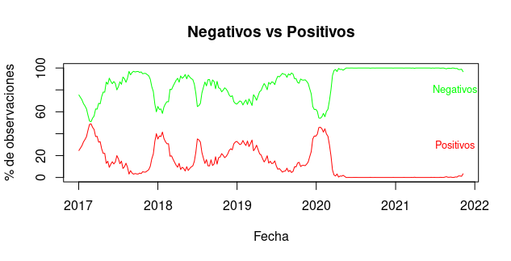

### 

Esta gráfica muestra las temporadas más altas de contagíos.

En la siguiente imágen se muestran las series de tiempo de las nuevas infecciones por tipo, podemos observar que los máximos locales con poca diferencia entre si.

Tomando las series diferenciadas se puede observar mejor la voltatilidad de las series.
