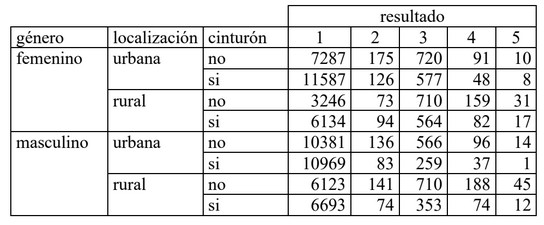

### La tabla presenta los resultados que tuvieron pasajeros en vehículos accidentados,de acuerdo al género, el lugar del accidente y el uso de cinturón de seguridad. Las categorías de resultado son:

\[\begin{align*}
1.& \mbox{ No se lastimo.}\\
2.& \mbox{ Lastimado, pero sin necesidad de ser transportado en ambulancia.}\\
3.& \mbox{ Lastimado, transportado por ambulancia, pero no hospitalizado.}\\
4.& \mbox{ Lastimado, hospitalizado, pero sobrevivió.}\\
5.& \mbox{ Muerto.}
\end{align*}\]

Ajusta un modelo de asociación es decir considerando que no existe una variable respuesta y después ajusta dos modelos considerando que la variable resultado es repuesta uno considerando la variable resultado no ordenada y un modelo considerándola ordenada. Comenta tus resultados.




-----------------------------------------------------
Modelo de asociación
-----------------------------------------------------

```{r}
library("VGAM")
modelo = vglm(cbind(r1,r2,r3,r4,r5)~sexo+comunidad+ cinturon,
                data = T3P1,
                family = multinomial(refLevel = 1)) 

summary(modelo)
```

El modelo nos muestra que los personas con mejores posibilidades de salir lo menos lastimadas posibles en un accidente son: mujeres que usan citurón de seguridad y conducen por una comunidad rural. 


---------------------------------------------------------------
Modelo con variable respuesta categorica
---------------------------------------------------------------

Usando los niveles como respuestas categoricas obtenemos estimaciones bastante similares a las anteriores, pero en general podría no pasar.

```{r}
library("nnet")
modelo2 = multinom(cbind(r1,r2,r3,r4,r5)~sexo+comunidad+ cinturon,
                data = T3P1) 

summary(modelo2)
```


--------------------------------------------------------
Modelo con variable respuesta ordinal
--------------------------------------------------------

Los coeficientes de la respuesta ordinal son bastante diferentes a los anteriores, pero los resultados son similares (pero la interpretación cambia).

```{r}
library("VGAM")
modelo3 = vglm(cbind(r1,r2,r3,r4,r5) ~ sexo+comunidad+ cinturon, 
               family = cumulative(link = probit, reverse = TRUE,
                                    parallel = TRUE), 
                data = T3P1)
summary(modelo3)
```


