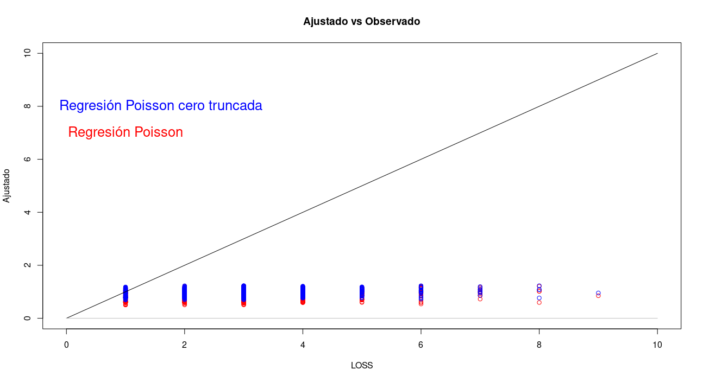

### Los datos en el archivo tarea3.xls representan

\[\begin{align*}
\mbox{ LOS}.& \mbox{ Length of stay in hospital (in days).}\\
\mbox{ Hospital}.& \mbox{ The hospital.}\\
\mbox{ Insurer}.& \mbox{ The insurer, either 0 or 1.}\\
\mbox{ Age}.& \mbox{ The age of the patient.}\\
\mbox{ Gender}.& \mbox{ The gender of the patient: 1 means Female, 0 means male.}\\
\mbox{ Race}.& \mbox{ The race of the patient: 1 means white, 2 means hispanic, 3 means black, 4 means Asian/Pacific Islander, 5 means Other.}\\
\mbox{ BedSize}.& \mbox{ The number of beds in the hospital: 1 means 1 to 99, 2 means 100 to 249, 3 means 250 to 400, 4 means 401 to 650.}\\
\mbox{ Owner}.& \mbox{ The hospital owner: 1 means public, 2 means private.}\\
\mbox{ Compl}.& \mbox{ If there were any treatment complication: 0 means no complications, 1 means complications.}\\
\end{align*}\]

La variable respuesta LOS no puede tomar el valor cero, ajusta modelos para conteos (poisson o binomial negativo) que consideren este hecho y modelos que no lo consideren y compara tus resultados. Realiza análisis post ajuste y comenta.


---------------------------------------------------------------------
Modelo Poisson Cero Truncado
---------------------------------------------------------------------
En este modelo consideraremos que la variable respuesta es positiva $(LOS>1)$.


```{r}
modelo = vglm(LOS ~  Age + Gender + Insurer + Owner,
                         family =  pospoisson(),
                         data = T3P2)
```


**[Analisis Post-ajuste](https://austriamax1.github.io/T3P2_1.html)**

---------------------------------------------------------------------
Regresión Poisson
---------------------------------------------------------------------

```{r}

modelo2 = glm(LOS ~  Age + Gender + Insurer + Owner,
              family =  poisson(),
              data = T3P2)

summary(modelo2)
```

**[Analisis Post-ajuste](https://austriamax1.github.io/T3P2_2.html)**

----------------------------------------------------------------
Conclusiones
----------------------------------------------------------------

El modelo cero truncado tiene el soporte correcto para los datos y eso ya es una ventaja, pero aun asi ninguno de los modelos tiene un buen ajuste (aun que no es necesariamente malo). Se puede observar que el modelo cero truncado ajusta las predicciones más alejadas del cero que la regresión Poisson. Se observan cambios relevantes en la magnitud de los parámetros (en terminos porcentuales).





