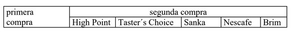
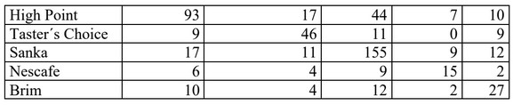

### Los datos de la tabla corresponden a compras de café instantáneo. Ajusta los modelos de simetría, homogeneidad marginal y cuasi independencia e interpreta.




Los modelos que se presentan describen las relaciones de transcisión entra maercas, sanka, high point y taster choice  son las mas consumidas. También podemos observar que las personas que toman como primera compra high point tienden a comprar sanka en la segunda ocasión, asi también si eligen sanka en su primera compra luego escogen high point o Brim.


Veamos. Primero construimos nuestra tabla

```{r}
library("catspec")

Freq <- c(93, 17, 44, 7, 10, 9, 46, 11, 0, 9, 17, 11, 
          155, 9, 12, 6, 4, 9, 15, 2,10, 4, 12, 2, 27)
primera<-gl(5,5,labels=c("High Point","Testers Choice","Sanka","Nescafe","Brim"))
segunda<-gl(5,1,labels=c("High Point","Testers Choice","Sanka","Nescafe","Brim"))
Compras <- data.frame(primera,segunda,Freq)
```

-------------------------------------------------------
Modelo de cuasi independencia
-------------------------------------------------------

```{r}
wt <- as.numeric(primera != segunda)
qi0<-glm(Freq~primera+segunda,
         weights=wt,
         family=poisson(),
         data=Compras)
summary(qi0)
```


--------------------------------------------------------------
Modelo de cuasi-simetria
--------------------------------------------------------------

```{r}
glm.qsym<-glm(Freq~primera+segunda+mob.symint(primera,segunda),
              family=poisson(),
              data=Compras)

summary(glm.qsym)
```

--------------------------------------------------------------
Modelo de Homegeneidad marginal
--------------------------------------------------------------

```{r}
glm.hrc1<-glm(Freq~primera+segunda+mob.rc1(primera,
                                           segunda,
                                           equal=TRUE),
              family=poisson(),
              data=Compras)
summary(glm.hrc1)
```
