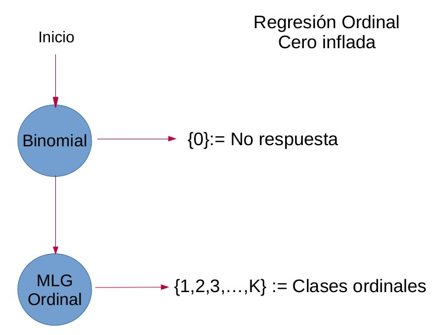

### Una variable ordinal de respuesta tiene las categorías: completamente de acuerdo, de acuerdo, en desacuerdo y completamente en desacuerdo, pero adicionalmente permite contestar no sé. Una manera de analizar seria considerar un modelo logístico para no sé contra todo lo demás y un modelo ordinal para el resto. 

¿Cómo escribirías la verosimilitud?

Escribiría la verosimilitud como \[\mathbb{P}(C=c) = [1-g^{-1}(X\beta^{(1)})]1_{C = 0} + pf_C(c)1_{C = 1, \dots, K}\]
Donde 
\[\begin{align*}
(C=0)&:= \mbox{No respuesta.}\\\\
p &:= \mbox{Probabilidad de obtener una respuesta.}\\\\
f&:= \mbox{Densidad del modelo ordinal.}\\\\
g&:= \mbox{Función logit.}\\\\
\end{align*}\]

¿De qué otra forma sugerirías analizarlo?

Si en lugar de tomar categoriar ordenadas se toma la proporción de una recta, donde los extremos se interpretarian como ``completamente de acuerdo'' y ``completamente en desacuerdo''. Obtendríamos una regresión Beta - cero inflada. 

Sabemos que la densidad de una beta $Beta(\alpha,\beta)$ tiene la forma \[f(y|\alpha,\beta) = \frac{y^{\alpha-1}(1-y)^{\beta-1}}{B(\alpha,\beta)}\]

Pero reparametrizandola como $Beta(\mu\phi,\phi (1-\phi))$ tenemos:

\[\begin{align*}
\mathbb{E}[Y]&= \mu\\\\
Var[Y]&= \frac{\mu(1-\mu)}{1+ \phi}\\\\
f(\mu_i) &= \eta_i\\
&= log(\frac{\mu_i}{1-\mu_i})\\ 
&= X_i\beta.\\
\end{align*}\]
