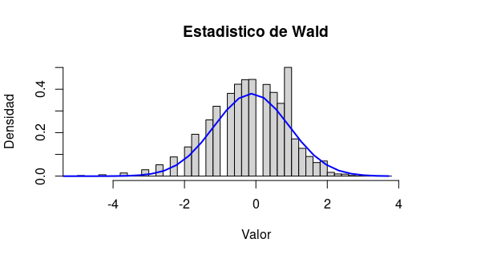

###  (Computer Experiment.) Let $\lambda_0 = 1$, $n = 20$ and $alpha = .05$. Simulate $X_1, \dots, X_n \sim Poisson(\lambda_0)$ and perform the Wald test. Repeat many times and count how often you reject the null. How close is the type I error rate to .05?

```{r}
#Fijando la semilla de números aleatorios.
set.seed(1)

#Parámetros de la simulación.
lamda0 = 1
n = 20
alfa = 0.05

#C:= limite de la región de rechazo.
c = qnorm(1-alfa/2)

resultados = sapply(1:1000000, function(s){
  #simulando datos
  x = rpois(n,lamda0)
  
  #Estimando
  lamdaHat = mean(x)
  
  #Estadistico de prueba
  W = (lamdaHat-lamda0)/sqrt(lamdaHat/n)
  
  #Prueba
  test = (abs(W)>c)
  
  return(c(W,test))
})

#Error tipo 1
mean(resultados[2,])

```


La prueba comete el error tipo 1 un \%5.26 de las veces. Por lo que es proximo al \%5, ligeramente mayor.


hist(resultados[1,],
     main = "Estadistico de Wald",
     breaks = 50,
     freq = FALSE,
     xlab = "Valor",
     ylab = "Densidad",
     ylim = c(0,0.5),
     xlim = c(-5,5))

xfit<-seq(min(resultados[1,])-0.1,max(resultados[1,])+0.1,length=40)
yfit<-dnorm(xfit,mean=mean(resultados[1,]),sd=sd(resultados[1,]))
lines(xfit, yfit, col="blue", lwd=2)
