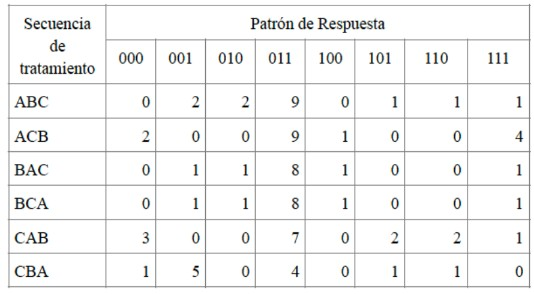
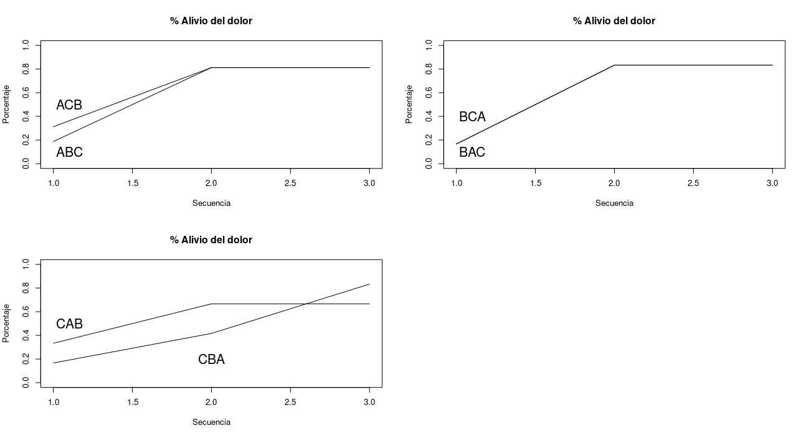

### La tabla refiere a un ensayo clínico cruzado con tres tratamientos, para evaluar dos analgésicos. Se compara un placebo (A), un tratamiento de dosis baja (B) y un tratamiento de dosis alta (C). Los pacientes están divididos aleatoriamente en seis grupos, las formas posibles de administrar los tratamientos. Al final de cada período, cada sujeto responde si tuvo alivio o no. Si $y_{itk} = 1$ denota alivio para el sujeto $i$, en la secuencia $k$, usando el tratamiento $t$ ($t = A,B,C). Ajusta un modelo (entre marginal, efectos aleatorios y de transición) y di porque escoges ese.



Solución:

La siguiente gráfica muestra el porcentaje de personas con alivio separado por tratamientos.



Lo anterior nos sugiere que comenzar con dosis altas no parece ser lo más provechoso. Y parece que hay un efecto de "memoria". Por lo anterior se elige un modelo marginal con el tiempo como covariable y el tipo de tratamiento como individuo. 

```{r}
#Ajustando el modelo
modelo = geepack::geeglm(cbind(Nalivio,Total) ~ Tipo + Dosis2 +Dosis3,
               family = binomial(link = "logit"),
               data = T4P2_tabla,
               id = Tratamiento,
               corstr = "ar1")

#No se encontró evidencia de que el medicamento funcione
summary(modelo)
```

No hay evidencia de que el medicamento funcione mejor que el placebo. Después de las tres dosis hay una mejora, pero no hay evidencia que sea por el medicamento (simplemento por el paso del tiempo).


```{r}
#Residuales
plot(modelo)
```
