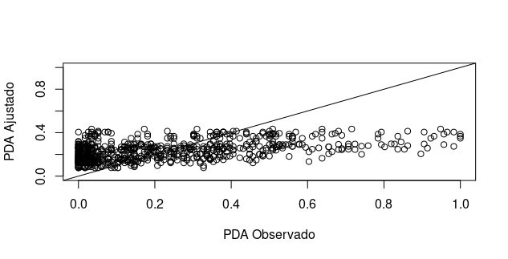

### Los datos del archivo tarea4 representan los datos para 118 sujetos que participaron en un estudio para ver si beber el yogurt después de una comida muy contaminada les ayudaba con la indigestión. La manera de medir la respuesta era sobre una línea donde con una cruz indicaban como se sentían. La longitud de la línea (da) se normalizo a 100(pda), cualquiera de las dos puede ser la variable respuesta. Las variables explicativas son: género, edad, y si el individuo tenia helicobacter o no, medida en dos maneras una con la concentración encontrada y otro como presencia o ausencia. El objetivo es ver si el yogurt v es  mejor que el yogurt r.


------------------------------------------------------------------
Estadística Descriptiva
------------------------------------------------------------------
Observando la **[estadistica descriptiva](https://austriamax1.github.io/T4P3_ED.html)**, podríamos pensar que el pda puede modelarse como una proporcion que tiene una distribución Beta que esta en función de las covariables, por eso use el paquete **[betareg](https://cran.r-project.org/web/packages/betareg/vignettes/betareg.pdf)**.

El modelo ajustado es el siguiente:

\[logit(\mu_i) =  \beta_0 + \sum_{i = 1}^n \beta_iX_i\]

Por lo que 

\[\mu_i =  \frac{\exp(\beta_0 + \sum_{i = 1}^n \beta_iX_i)}{1+\exp(\beta_0 + \sum_{i = 1}^n \beta_iX_i)}\]

------------------------------------------------------------------
Regresión Beta
------------------------------------------------------------------
Antes de ajustar el modelo, planche las observaciones cuyo pda era exactamente 100 o 0; los reemplace por 99.999 y 0.001. Después dividi entre 100.


```{r}
library("betareg")
modelo <- betareg(pda ~ genero  + tiempo +grupodeprueba + heli | nosujeto, data = T4P3tabla)
summary(modelo)
```

La interpretación de los coeficientes del modelo es similar al logistico, asi. Si el final de la linea indicaba ``muy bien'', en ese caso el yogur V es peor que el R pues su coeficiente es negativo. Si el sentido de la linea es el contrario entonces su significado es el opuesto.

El análisis **[post ajuste](https://austriamax1.github.io/T4P3_Postajuste.html)** no muestra que el modelo tenga problemas severos de sobredisperción, correlación u observaciones influyentes.


El ajuste del modelo no es excelente pero describe de buena manera la mayoria de las observaciones.




