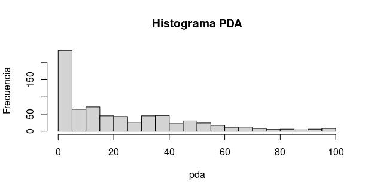
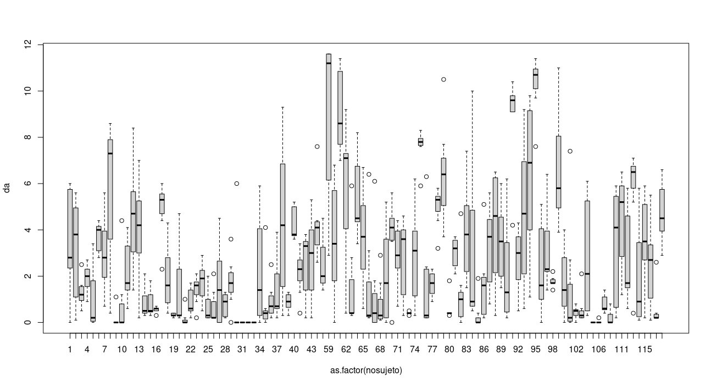
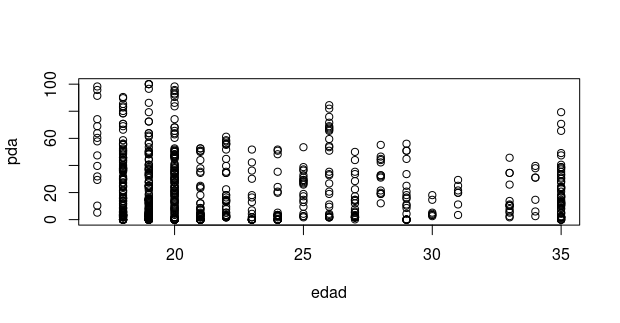
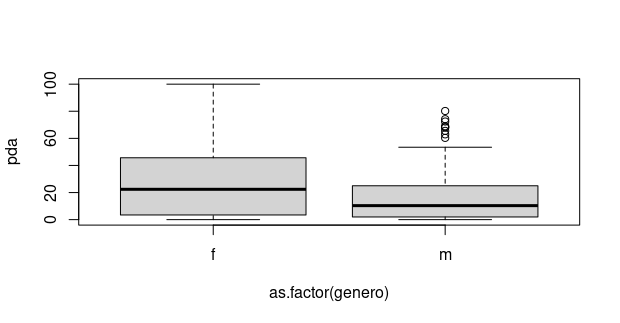
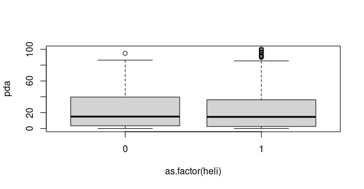

### A continuación se mostrará algunas gráficas que describen los datos de Yogurt.

-------------------------------------------------------------
La mayoria de las observaciones tienen un pda bajo.

-------------------------------------------------------------
Puede haber mucha diferencia entre los individuos, algunos variaron mucho durante el estudio y otros no.

--------------------------------------------------------------------
El grafico siguiente es el de la edad contra pda, muestra que a mayor edad hay menor pda, PERO la caida es muy lenta (la correlación es de -0.09701717).

-----------------------------------------------------------------
Las mujeres tienden a tener mayor pda.

-----------------------------------------------------------------

Se observan pocas diferencias entre tener o no tener helicobacter, la más notoria es el número de observaciones con más de 90 pda.

