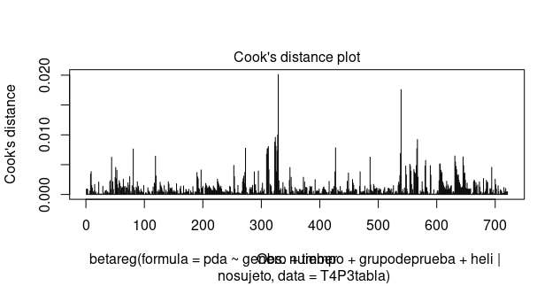
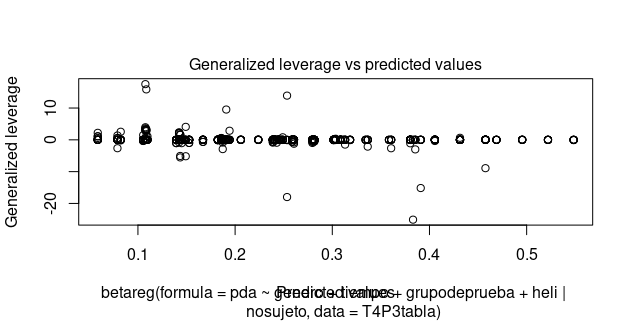
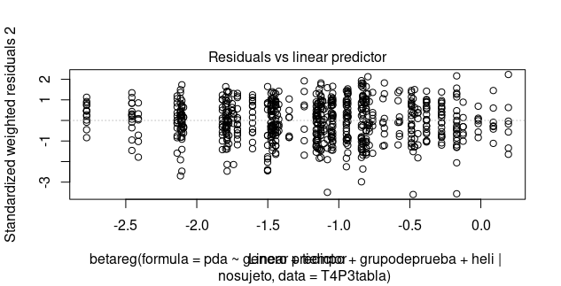

### El problema principal de estos residuales es que entre mas grande sea el predictor lineal, crece el error de tal manera que forman lineas rectas, posiblemente por variables faltantes o porque el calculo se hizo suponiendo independencia entre las observaciones (cosa que no se cumple por ser datos panel).

