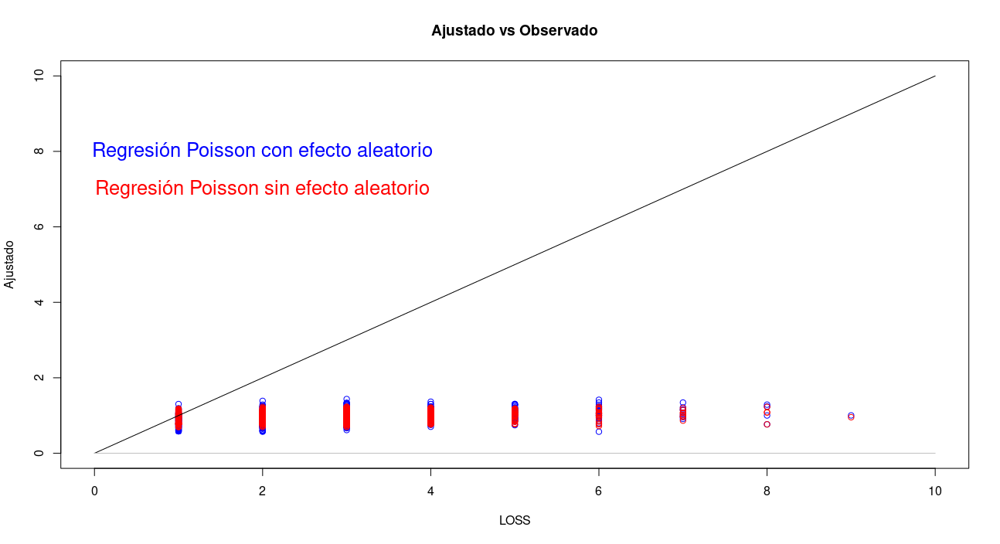

### Con los datos hospitales ajusta un modelo con efectos aleatorios ya sea un modelo mixto o hglm y compara los resultados con los de la tarea anterior.


Se ajusto el mismo modelo que en la tarea 3 pero agregando el id del hospital como efecto aleatorio (el id es una variable tipo factor). De esta menera se mejora el **[análisis post-ajuste](https://austriamax1.github.io/T4P4_Posajuste.html)**. 

Las variables que antes eran significativas lo siguen siendo, y no se agregaron más. 


```{r}
library(lme4)
(modelo2 = glm(LOS ~  Age + Gender + Insurer + Owner,
              family =  poisson(), data = T3P2))
modelo3 = glmer(LOS ~  Age + Gender + Insurer + Owner + (1|Hospital),family =  poisson(), data = T3P2)
summary(modelo3)
```
El nuevo modelo tiene un ajuste moderado pero se comprueba que el efecto aleatorio resulta significativo.


```{r}
anova(modelo3,modelo2)
```



